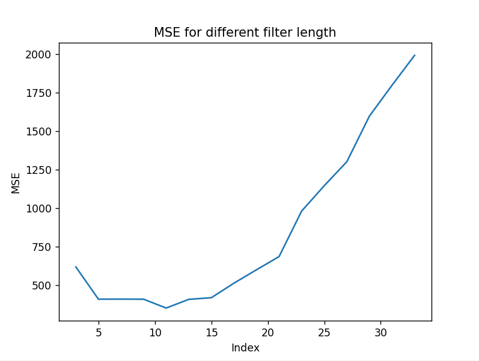
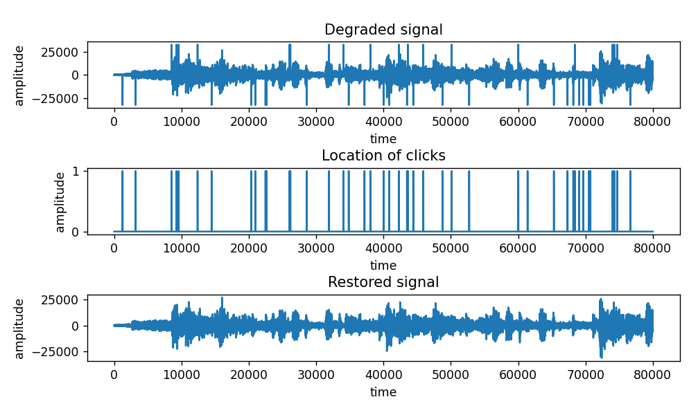
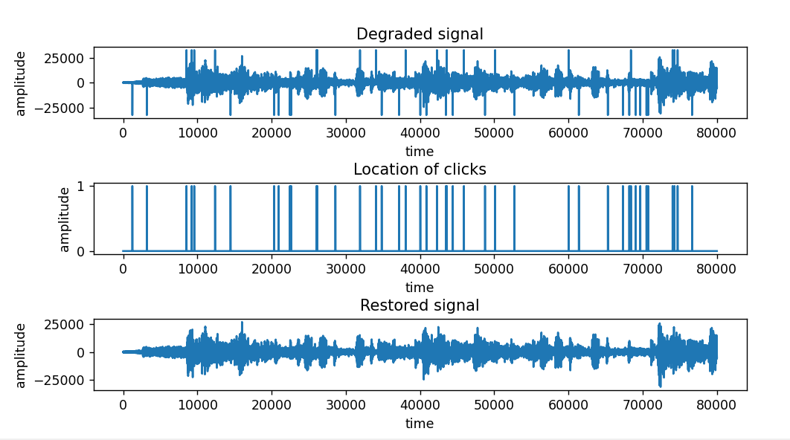

# Computational_methods_Assignment2
# Audio Restoration using Median filter and Cubic splines filter

## High-level Description of the project
This assignment builds on Assignment I. We assume that we have successfully detected the clicks and we are applying different interpolation methods to restore the audio, such as
- median filtering
- cubic splines

---

## Installation and Execution

### Installation

The following modules are required for running this project

```python
matplotlib==3.6.2
numpy==1.23.5
playsound==1.2.2
scipy==1.9.3
tqdm==4.64.1
```

### Execution

After installing the required packages, the code can be run by

```sh
python Median_filtering_audio.py
python Cubic_splines_filtering_audio.py
```
---

## Methodology and Results

### Methodology

The project contains 4 python files

* #### Median_filtering_audio.py

  This code calls the median filter fuction from the file *medianFilter.py* to restore a degraded signal named **degraded.wav**.
  This is done by replacing the degraded values of the signals with the median filtered value at that location. The locations of degradations (i.e the clicks) is present in the signal **detectionfile.wav**. The data in **detectionfile.wav** is such that wherever a click is present, the value at that index is 1. The restored signal is generated by using data from  **degraded.wav** and **detectionfile.wav**. 

  First, the signals **degraded.wav**, **detectionfile.wav** are read into arrays called _data, clicks_ respectively. Then the  degraded signal is median filtered using the function _medianFilter_ and stored in an array _y_. Next, we replace the values at the click locations with the values from _y_ and store it in an array _r_ using the following formula: 

  $$r = (1 - clicks) * data + clicks * y$$

  The data _r_ is written into the file **outputfile.wav**. We check how well the restoration was performed by calculating the mean squared error between restored data and the uncorrupted signal data which comes from **clean.wav**. We obtain the minimum of mean square errors for different window lengths for the median filter and decide on the best window length for the median filter for this audio restoration.


* #### Cubic_splines_filtering_audio.py
  This code uses the method of Cubic Splines interpolation to restore the degraded signal. The degraded signal **degraded.wav** is restored by replacing the values at the location of the clicks (locations given by the data in signal **detectionfile.wav**) with the value predicted by the cubic splines filter function from the scipy module in python. The restored data is written to the audio file **output_cubicSplines.wav**.

* #### medianFilter.py
  This file contains the _medianFilter_ function used for median filtering the degraded audio. A median filter is a nonlinear filter in which each output sample is computed as the median value of the input samples under the window – that is, the result is the middle value after the input values have been sorted. The window length for median filtering is an odd number. Median filtering data helps remove the outliers in the data. Clicks being very different from the original audio signals are a good target for getting filtered with median filter.

* #### unittest_median_filter.py
  This function is used to test the the accuracy of the _medianFilter_ function in the file *medianFilter.py* by performing a unittest.


### Results

Both median filter and cubic splines filter performed a fairely good restoration of audio by removing the clicks in the degraded signal.

1. For the median filter, different filter lengths were explored to test the effectiveness of the restoration. In particular, odd window lengths in the range 3 - 35 were tested and window length 11 was observed to deliver the lowest MSE for this particular signal, as shown in the figure below.



The signal plots after the median filter restoration are as follows 



2. Using the cubic splines, we observe that the signal gets restored at the location of the clicks with the data predicted from the cubic splines function. 

The signal plots after the cubic splines filter restoration are as follows 



3. Comparing the two different interpolation methods, we notice that method using median filter with a window length of 11 achieves a lower MSE when compared to cubic splines.

After listening to the two restored files, we see that the signals sounds very similar to the original uncorrupted signal.Hence, a proper Audio restoration is performed.


---
## Credits

This code was developed for purely academic purposes by Priya Varenya Sangem (Priya_Varenya_Sangem) as part of the module Computational Methods 

Resources:
- <https://www.sciencedirect.com/topics/computer-science/median-filter#:~:text=A%20median%20filter%20is%20a,number%20of%20taps%20is%20used.>


